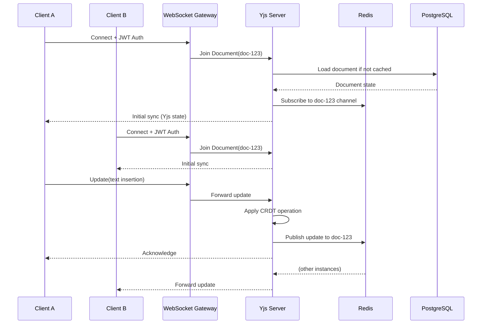

# ContentForge AI - Phase 4 Technical Architecture

> Technical architecture design for Phase 4: Real-time collaboration infrastructure, analytics platform, enterprise security, AI services, and marketplace ecosystem.

---

## Table of Contents

1. [Architecture Overview](#1-architecture-overview)
2. [Real-Time Collaboration Infrastructure](#2-real-time-collaboration-infrastructure)
3. [Analytics Platform](#3-analytics-platform)
4. [Enterprise Security Architecture](#4-enterprise-security-architecture)
5. [AI Services Architecture](#5-ai-services-architecture)
6. [Marketplace Architecture](#6-marketplace-architecture)
7. [Infrastructure & DevOps](#7-infrastructure--devops)
8. [Migration Strategy](#8-migration-strategy)

---

## 1. Architecture Overview

### Phase 4 Architecture Vision

Phase 4 transforms ContentForge from a content operations platform into an **enterprise-grade collaborative ecosystem**. The architecture must support:

- **Real-time collaboration** at scale (50+ concurrent editors)
- **Sub-second analytics** for data-driven decisions
- **Enterprise security** with SSO, audit logs, compliance
- **Extensible AI** with custom model training
- **Third-party ecosystem** via plugins and marketplace

### Updated System Architecture Diagram

```
┌─────────────────────────────────────────────────────────────────────────────────────────────┐
│                                      CLIENT LAYER                                            │
│  ┌─────────────────┐  ┌─────────────────┐  ┌─────────────────┐  ┌─────────────────┐          │
│  │   Web Browser   │  │  Mobile Browser │  │    API Client   │  │   Plugin SDK    │          │
│  │                 │  │                 │  │                 │  │                 │          │
│  └────────┬────────┘  └────────┬────────┘  └────────┬────────┘  └────────┬────────┘          │
└──────────┼────────────────────┼────────────────────┼────────────────────┼──────────────────┘
           │                    │                    │                    │
           ▼                    ▼                    ▼                    ▼
┌─────────────────────────────────────────────────────────────────────────────────────────────┐
│                                    FRONTEND LAYER                                            │
│  ┌──────────────────────────────────────────────────────────────────────────────────────┐  │
│  │                        Next.js 14 + Yjs (Collaborative State)                        │  │
│  │                    (Vercel - Edge Network, Serverless)                                │  │
│  │  Components:                                                                         │  │
│  │    - Collaborative Editor (Yjs + Tiptap/ProseMirror)                                │  │
│  │    - Analytics Dashboard (Recharts + TanStack Query)                                │  │
│  │    - Marketplace (Stripe + Custom Components)                                        │  │
│  │    - Plugin Sandbox (Iframe + PostMessage API)                                      │  │
│  └─────────────────────────────────┬────────────────────────────────────────────────────┘  │
└────────────────────────────────────┼────────────────────────────────────────────────────────┘
                                     │ HTTPS / WebSocket
                                     ▼
┌─────────────────────────────────────────────────────────────────────────────────────────────┐
│                                    API GATEWAY                                               │
│  ┌──────────────────────────────────────────────────────────────────────────────────────┐  │
│  │                           Kong / AWS API Gateway (Future)                             │  │
│  │         Rate Limiting, Auth, CORS, GZIP, Request Routing, Analytics Tracking          │  │
│  │                                                                                       │  │
│  │  Routes:                                                                              │  │
│  │    /api/v1/*     → FastAPI Backend                                                    │  │
│  │    /collab/*     → Collaboration Service (WebSocket)                                │  │
│  │    /analytics/*  → Analytics API                                                      │  │
│  │    /marketplace/* → Marketplace Service                                             │  │
│  │    /plugins/*    → Plugin Proxy                                                     │  │
│  └─────────────────────────────────┬────────────────────────────────────────────────────┘  │
└────────────────────────────────────┼────────────────────────────────────────────────────────┘
                                     │
           ┌─────────────────────────┼─────────────────────────┐
           ▼                         ▼                         ▼
┌─────────────────────┐    ┌─────────────────────┐    ┌─────────────────────┐
│   BACKEND LAYER     │    │  COLLABORATION      │    │  ANALYTICS LAYER    │
│   (FastAPI)         │    │  SERVICE            │    │                     │
│                     │    │                     │    │                     │
│  ┌───────────────┐  │    │  ┌───────────────┐  │    │  ┌───────────────┐  │
│  │   Auth API    │  │    │  │  Yjs Server   │  │    │  │  Event Ingest │  │
│  │   (SSO/SAML)  │  │    │  │  (WebSocket)  │  │    │  │   API         │  │
│  └───────┬───────┘  │    │  └───────┬───────┘  │    │  └───────┬───────┘  │
│          │          │    │          │          │    │          │          │
│  ┌───────┴───────┐  │    │  ┌───────┴───────┐  │    │  ┌───────┴───────┐  │
│  │   Core API    │  │    │  │  Presence     │  │    │  │  Stream       │  │
│  │   (REST)      │  │    │  │  Manager      │  │    │  │  Processing   │  │
│  └───────┬───────┘  │    │  └───────┬───────┘  │    │  └───────┬───────┘  │
│          │          │    │          │          │    │          │          │
│  ┌───────┴───────┐  │    │  ┌───────┴───────┐  │    │  ┌───────┴───────┐  │
│  │   Audit API   │  │    │  │  Document     │  │    │  │  Warehouse    │  │
│  │               │  │    │  │  Persistence  │  │    │  │  (BigQuery)   │  │
│  └───────────────┘  │    │  └───────────────┘  │    │  └───────────────┘  │
│                     │    │                     │    │                     │
└──────────┬──────────┘    └──────────┬──────────┘    └──────────┬──────────┘
           │                          │                          │
           ▼                          ▼                          ▼
┌─────────────────────────────────────────────────────────────────────────────────────────────┐
│                                    DATA LAYER                                                │
│  ┌───────────────┐  ┌───────────────┐  ┌───────────────┐  ┌───────────────┐               │
│  │  Supabase     │  │  Redis        │  │  ClickHouse   │  │  Object       │               │
│  │  PostgreSQL   │  │  (Cache +     │  │  (Analytics)  │  │  Storage      │               │
│  │  Primary DB   │  │   Pub/Sub)    │  │               │  │  (R2)         │               │
│  └───────────────┘  └───────────────┘  └───────────────┘  └───────────────┘               │
│                                                                                              │
│  ┌───────────────┐  ┌───────────────┐  ┌───────────────┐  ┌───────────────┐               │
│  │  Kafka /      │  │  Elasticsearch│  │  S3 (Audit    │  │  Vector DB    │               │
│  │  Redpanda     │  │  (Search)     │  │   Logs)       │  │  (Embeddings) │               │
│  │  (Event Bus)  │  │               │  │               │  │               │               │
│  └───────────────┘  └───────────────┘  └───────────────┘  └───────────────┘               │
└─────────────────────────────────────────────────────────────────────────────────────────────┘
                                     │
           ┌─────────────────────────┼─────────────────────────┐
           ▼                         ▼                         ▼
┌─────────────────────┐    ┌─────────────────────┐    ┌─────────────────────┐
│   AI SERVICES       │    │  MARKETPLACE        │    │  ENTERPRISE         │
│                     │    │  SERVICES           │    │  SERVICES           │
│                     │    │                     │    │                     │
│  ┌───────────────┐  │    │  ┌───────────────┐  │    │  ┌───────────────┐  │
│  │  Model        │  │    │  │  Template     │  │    │  │  SAML/OIDC    │  │
│  │  Training     │  │    │  │  Service      │  │    │  │  Service      │  │
│  │  (Modal)      │  │    │  │               │  │    │  │               │  │
│  └───────┬───────┘  │    │  └───────┬───────┘  │    │  └───────┬───────┘  │
│          │          │    │          │          │    │          │          │
│  ┌───────┴───────┐  │    │  ┌───────┴───────┐  │    │  ┌───────┴───────┐  │
│  │  Inference    │  │    │  │  Plugin       │  │    │  │  Audit Log    │  │
│  │  API (Groq)   │  │    │  │  Registry     │  │    │  │  Service      │  │
│  └───────┬───────┘  │    │  └───────┬───────┘  │    │  └───────┬───────┘  │
│          │          │    │          │          │    │          │          │
│  ┌───────┴───────┐  │    │  ┌───────┴───────┐  │    │  ┌───────┴───────┐  │
│  │  Embeddings   │  │    │  │  Payment      │  │    │  │  Compliance   │  │
│  │  Service      │  │    │  │  (Stripe)     │  │    │  │  Service      │  │
│  └───────────────┘  │    │  └───────────────┘  │    │  └───────────────┘  │
│                     │    │                     │    │                     │
└─────────────────────┘    └─────────────────────┘    └─────────────────────┘
```

---

## 2. Real-Time Collaboration Infrastructure

### 2.1 Collaboration Service Architecture

```
┌─────────────────────────────────────────────────────────────────────────────┐
│                        COLLABORATION SERVICE                                 │
│                                                                              │
│  ┌──────────────────────────────────────────────────────────────────────┐    │
│  │                    WebSocket Gateway (Node.js/uWebSockets)            │    │
│  │                                                                      │    │
│  │   Responsibilities:                                                  │    │
│  │     - WebSocket connection management                                │    │
│  │     - Message routing                                                │    │
│  │     - Authentication (JWT validation)                                │    │
│  │     - Rate limiting                                                  │    │
│  │                                                                      │    │
│  │   Scaling: Horizontal with Redis adapter                             │    │
│  │   Capacity: 10K concurrent connections per instance                    │    │
│  └───────────────────────────────┬──────────────────────────────────────┘    │
│                                  │                                          │
│                                  ▼                                          │
│  ┌──────────────────────────────────────────────────────────────────────┐  │
│  │                    Yjs Document Server                                 │  │
│  │                                                                      │  │
│  │   Responsibilities:                                                  │  │
│  │     - CRDT state management                                          │  │
│  │     - Operational transformation                                     │  │
│  │     - Sync protocol handling                                         │  │
│  │                                                                      │  │
│  │   Document Storage:                                                  │  │
│  │     - In-memory: Active documents                                    │  │
│  │     - Redis: Document snapshots (every 30s)                          │  │
│  │     - PostgreSQL: Persistent storage                                 │  │
│  └───────────────────────────────┬──────────────────────────────────────┘  │
│                                  │                                          │
│                                  ▼                                          │
│  ┌──────────────────────────────────────────────────────────────────────┐  │
│  │                    Presence Manager                                    │  │
│  │                                                                      │  │
│  │   Responsibilities:                                                  │  │
│  │     - User presence tracking                                         │  │
│  │     - Cursor position sync                                           │  │
│  │     - Selection sync                                                 │  │
│  │                                                                      │  │
│  │   Sync: Redis Pub/Sub for multi-instance                             │  │
│  └──────────────────────────────────────────────────────────────────────┘  │
└─────────────────────────────────────────────────────────────────────────────┘
```

### 2.2 Document Sync Flow



### 2.3 Technical Specifications

#### WebSocket Infrastructure

```yaml
Technology Stack:
  Gateway: Node.js with uWebSockets.js (C++ bindings)
  Alternative: Socket.io (with Redis adapter)
  Protocol: Native WebSocket (ws:// or wss://)
  Message Format: Binary (Yjs protocol) + JSON for control

Connection Management:
  Max Connections: 10,000 per instance
  Heartbeat Interval: 30 seconds
  Timeout: 60 seconds without heartbeat
  Reconnection: Exponential backoff (1s, 2s, 4s, 8s, max 30s)

Scaling Strategy:
  Load Balancer: Sticky sessions (by document ID hash)
  Redis Adapter: Sync presence across instances
  Horizontal: Auto-scale based on connection count
```

#### CRDT Implementation

```typescript
// Yjs document structure
import * as Y from 'yjs';

class CollaborativeDocument {
  private doc: Y.Doc;
  private awareness: Y.Awareness;
  
  constructor(documentId: string) {
    this.doc = new Y.Doc();
    this.awareness = new Y.Awareness(this.doc);
    
    // Document structure
    this.doc.getMap('meta'); // Metadata
    this.doc.getText('title'); // Content title
    this.doc.getXmlFragment('content'); // Rich content
    this.doc.getArray('blocks'); // Content blocks
    
    // Persistence
    this.setupPersistence(documentId);
  }
  
  private setupPersistence(documentId: string) {
    // Snapshot every 30 seconds
    setInterval(() => {
      const snapshot = Y.encodeStateAsUpdate(this.doc);
      redis.setex(`doc:${documentId}:snapshot`, 3600, snapshot);
    }, 30000);
  }
}

// Sync protocol
interface SyncMessage {
  type: 'sync' | 'awareness' | 'presence';
  documentId: string;
  data: Uint8Array;
}
```

#### Document Persistence Strategy

```yaml
Hot Storage (Active Documents):
  - In-memory: Yjs document objects
  - TTL: Document unloaded after 5 min inactivity
  - Max active: 1000 documents per instance

Warm Storage (Recent Documents):
  - Redis: Binary state updates
  - TTL: 24 hours
  - Purpose: Fast rehydration

Cold Storage (All Documents):
  - PostgreSQL: Encoded Yjs updates
  - Table: document_updates
  - Retention: Forever
  - Compression: gzip

Backup:
  - S3: Daily snapshots
  - Retention: 30 days
```

### 2.4 Performance Targets

| Metric | Target | Measurement |
|--------|--------|-------------|
| Sync Latency | <100ms | 95th percentile, same region |
| Concurrent Editors | 50+ per doc | Load tested |
| Connection Capacity | 10K per instance | WebSocket connections |
| Document Load Time | <500ms | From cold storage |
| Memory per Document | <10MB | Peak usage |

---

## 3. Analytics Platform

### 3.1 Event-Driven Architecture

```
┌─────────────────────────────────────────────────────────────────────────────┐
│                            EVENT INGESTION                                   │
│                                                                              │
│  ┌─────────────┐    ┌─────────────┐    ┌─────────────┐    ┌─────────────┐   │
│  │   Client    │    │   Backend   │    │   Workers   │    │  Webhooks   │   │
│  │   Events    │    │   Events    │    │   Events    │    │   Events    │   │
│  └──────┬──────┘    └──────┬──────┘    └──────┬──────┘    └──────┬──────┘   │
│         │                  │                  │                  │         │
└─────────┼──────────────────┼──────────────────┼──────────────────┼─────────┘
          │                  │                  │                  │
          ▼                  ▼                  ▼                  ▼
┌─────────────────────────────────────────────────────────────────────────────┐
│                           MESSAGE QUEUE (Kafka)                              │
│                                                                              │
│   Topics:                                                                    │
│     - events.raw (all events)                                                │
│     - events.enriched (with user/context data)                               │
│     - events.analytics (aggregated)                                          │
│                                                                              │
│   Partitions: 12 per topic                                                   │
│   Replication: 3                                                             │
│   Retention: 7 days                                                          │
└───────────────────────────────┬─────────────────────────────────────────────┘
                                │
                                ▼
┌─────────────────────────────────────────────────────────────────────────────┐
│                         STREAM PROCESSING                                    │
│                                                                              │
│   ┌─────────────────┐    ┌─────────────────┐    ┌─────────────────┐       │
│   │   Enrichment    │───▶│   Aggregation   │───▶│   Routing       │       │
│   │                 │    │                 │    │                 │       │
│   │   - Add user    │    │   - Windowed    │    │   - Analytics   │       │
│   │     context     │    │     counts      │    │     DB          │       │
│   │   - Geolocation │    │   - Sessionize  │    │   - Data Lake   │       │
│   │   - Device      │    │   - Funnel calc │    │   - Real-time   │       │
│   └─────────────────┘    └─────────────────┘    └─────────────────┘       │
│                                                                              │
│   Technology: Kafka Streams / Flink (future)                                 │
└───────────────────────────────┬─────────────────────────────────────────────┘
                                │
           ┌────────────────────┼────────────────────┐
           ▼                    ▼                    ▼
┌─────────────────┐    ┌─────────────────┐    ┌─────────────────┐
│   REAL-TIME     │    │   DATA WAREHOUSE│    │   CACHING       │
│   ANALYTICS     │    │                 │    │                 │
│                 │    │   (ClickHouse)  │    │   (Redis)       │
│   - Dashboard   │    │                 │    │                 │
│     updates     │    │   - Cohort      │    │   - Query       │
│   - Alerts      │    │     analysis    │    │     results     │
│   - WebSocket   │    │   - Funnels     │    │   - Hot data    │
│     push        │    │   - Attribution │    │                 │
│                 │    │   - Custom SQL  │    │                 │
└─────────────────┘    └─────────────────┘    └─────────────────┘
```

### 3.2 Event Schema

```typescript
// Base event schema
interface AnalyticsEvent {
  // Identity
  event_id: string; // ULID
  event_time: string; // ISO 8601
  
  // Context
  user_id: string;
  anonymous_id?: string;
  organization_id?: string;
  session_id: string;
  
  // Event
  event_type: string; // content.created, user.login, etc.
  event_category: 'content' | 'engagement' | 'conversion' | 'system';
  
  // Properties
  properties: Record<string, any>;
  
  // Context
  context: {
    page?: {
      url: string;
      path: string;
      referrer: string;
    };
    device?: {
      user_agent: string;
      ip: string;
      screen?: { width: number; height: number };
    };
    campaign?: {
      utm_source?: string;
      utm_medium?: string;
      utm_campaign?: string;
    };
  };
}

// Example events
interface ContentCreatedEvent extends AnalyticsEvent {
  event_type: 'content.created';
  properties: {
    content_id: string;
    content_type: 'blog' | 'social' | 'newsletter';
    source_type: 'ai' | 'manual' | 'import';
    word_count: number;
    generation_time_ms: number;
  };
}

interface DistributionCompletedEvent extends AnalyticsEvent {
  event_type: 'distribution.completed';
  properties: {
    content_id: string;
    distribution_id: string;
    platforms: string[];
    success_count: number;
    failure_count: number;
  };
}
```

### 3.3 Data Warehouse Schema

```sql
-- ClickHouse tables for analytics

-- Raw events (distributed)
CREATE TABLE events ON CLUSTER '{cluster}' (
    event_id UUID,
    event_time DateTime64(3),
    user_id UUID,
    organization_id Nullable(UUID),
    session_id UUID,
    event_type LowCardinality(String),
    event_category LowCardinality(String),
    properties String, -- JSON
    
    -- Context
    url String,
    path String,
    referrer String,
    user_agent String,
    ip IPv4,
    utm_source Nullable(String),
    utm_medium Nullable(String),
    utm_campaign Nullable(String),
    
    -- Derived
    event_date Date DEFAULT toDate(event_time),
    platform LowCardinality(String) MATERIALIZED parseUserAgent(user_agent).platform
) ENGINE = ReplicatedMergeTree('/clickhouse/tables/{shard}/events', '{replica}')
PARTITION BY toYYYYMMDD(event_date)
ORDER BY (organization_id, event_type, event_time);

-- Cohort analysis materialized view
CREATE MATERIALIZED VIEW cohort_analysis ON CLUSTER '{cluster}'
ENGINE = SummingMergeTree()
PARTITION BY toYYYYMM(cohort_week)
ORDER BY (cohort_week, utm_source, plan_type)
AS SELECT
    toStartOfWeek(user_created_at) as cohort_week,
    utm_source,
    plan_type,
    countDistinct(user_id) as cohort_size,
    countDistinctIf(user_id, event_date = toDate(cohort_week)) as d0_users,
    countDistinctIf(user_id, event_date = toDate(cohort_week) + 1) as d1_users,
    countDistinctIf(user_id, event_date = toDate(cohort_week) + 7) as d7_users,
    countDistinctIf(user_id, event_date = toDate(cohort_week) + 30) as d30_users
FROM events e
JOIN users u ON e.user_id = u.id
GROUP BY cohort_week, utm_source, plan_type;
```

### 3.4 Analytics API

```yaml
Query Endpoints:
  POST /analytics/v1/query:
    description: Execute custom SQL query (read-only)
    request:
      query: string
      parameters: object
    response:
      columns: ColumnDefinition[]
      rows: any[]
      execution_time_ms: number
    
  GET /analytics/v1/cohorts:
    description: Get cohort analysis data
    parameters:
      start_date: string
      end_date: string
      granularity: 'day' | 'week' | 'month'
      filters: object
    
  GET /analytics/v1/funnels/{funnel_id}:
    description: Get funnel conversion data
    
  GET /analytics/v1/metrics:
    description: Get time-series metrics
    parameters:
      metrics: string[]
      start: string
      end: string
      interval: 'hour' | 'day' | 'week' | 'month'
```

---

## 4. Enterprise Security Architecture

### 4.1 SSO Architecture

```
┌─────────────────────────────────────────────────────────────────────────────┐
│                              SSO ARCHITECTURE                                │
│                                                                              │
│   ┌─────────────────┐              ┌─────────────────┐                     │
│   │   User Browser  │              │   Identity      │                     │
│   │                 │              │   Provider      │                     │
│   │   (SP-initiated)│              │   (Okta, Azure) │                     │
│   └────────┬────────┘              └────────┬────────┘                     │
│            │                                 │                              │
│            │ 1. Access protected resource    │                              │
│            │◀────────────────────────────────│                              │
│            │                                 │                              │
│            │ 2. Redirect to IdP              │                              │
│            │────────────────────────────────▶│                              │
│            │                                 │                              │
│            │ 3. Authenticate                 │                              │
│            │◀────────────────────────────────▶│                              │
│            │                                 │                              │
│            │ 4. POST SAMLResponse            │                              │
│            │────────────────────────────────▶│                              │
│            │                                 │                              │
│            │ 5. Validate + Create session   │                              │
│            │ (Internal processing)          │                              │
│            │                                 │                              │
│            │ 6. Redirect with JWT            │                              │
│            │◀────────────────────────────────│                              │
│                                                                              │
└─────────────────────────────────────────────────────────────────────────────┘

┌─────────────────────────────────────────────────────────────────────────────┐
│                         SAML/OIDC SERVICE                                    │
│                                                                              │
│   ┌─────────────────────────────────────────────────────────────────────┐   │
│   │                    SAML Identity Provider (python3-saml)             │   │
│   │                                                                      │   │
│   │   Responsibilities:                                                  │   │
│   │     - SAML Request/Response parsing                                  │   │
│   │     - XML signature validation                                       │   │
│   │     - Attribute mapping                                              │   │
│   │     - Metadata generation                                            │   │
│   └─────────────────────────────────────────────────────────────────────┘   │
│                                                                              │
│   ┌─────────────────────────────────────────────────────────────────────┐   │
│   │                    OIDC Relying Party (oidc-op)                      │   │
│   │                                                                      │   │
│   │   Responsibilities:                                                  │   │
│   │     - Authorization Code flow                                        │   │
│   │     - Token validation (ID, access, refresh)                       │   │
│   │     - UserInfo endpoint calls                                        │   │
│   │     - Session management                                             │   │
│   └─────────────────────────────────────────────────────────────────────┘   │
│                                                                              │
│   ┌─────────────────────────────────────────────────────────────────────┐   │
│   │                    Just-in-Time Provisioning                         │   │
│   │                                                                      │   │
│   │   Responsibilities:                                                  │   │
│   │     - Create user on first SSO login                                 │   │
│   │     - Role/permission mapping                                        │   │
│   │     - Organization assignment                                        │   │
│   │     - Profile sync on subsequent logins                              │   │
│   └─────────────────────────────────────────────────────────────────────┘   │
└─────────────────────────────────────────────────────────────────────────────┘
```

### 4.2 Audit Log Architecture

```
┌─────────────────────────────────────────────────────────────────────────────┐
│                           AUDIT LOG PIPELINE                                 │
│                                                                              │
│   Event Sources                    Ingestion                    Storage     │
│   ─────────────                    ─────────                    ────────     │
│                                                                              │
│   ┌──────────┐    ┌──────────┐    ┌──────────┐    ┌──────────┐             │
│   │  Auth    │───▶│          │    │          │    │          │             │
│   └──────────┘    │          │    │          │    │          │             │
│   ┌──────────┐    │   API    │───▶│  Kafka   │───▶│S3 (Cold) │             │
│   │  Content │───▶│ Gateway  │    │ Topic:   │    │7 years   │             │
│   └──────────┘    │          │    │audit.logs│    │          │             │
│   ┌──────────┐    │          │    │          │    │          │             │
│   │  Admin   │───▶│          │    │          │    │          │             │
│   └──────────┘    └──────────┘    └──────────┘    └──────────┘             │
│                                                         │                   │
│   ┌─────────────────────────────────────────────────────┘                   │
│   │                                                                        │
│   ▼                                                                        │
│  ┌─────────────────────────┐                                               │
│  │   Real-time Consumers   │                                               │
│  │                         │                                               │
│  │   - SIEM integration    │                                               │
│  │   - Alerting (anomalies)│                                               │
│  │   - Compliance reports  │                                               │
│  └─────────────────────────┘                                               │
│                                                                            │
└────────────────────────────────────────────────────────────────────────────┘

Security Features:
  - Immutable append-only storage
  - WORM (Write Once Read Many) compliance
  - Cryptographic verification (hash chain)
  - Access control (RBAC for audit access)
  - Encryption at rest (AES-256)
```

### 4.3 Security Configuration

```yaml
# security.yaml
authentication:
  methods:
    - password
    - saml
    - oidc
    - mfa (future)
  
  session:
    ttl: 86400  # 24 hours
    refresh_ttl: 604800  # 7 days
    sliding_window: true
  
  password_policy:
    min_length: 12
    require_uppercase: true
    require_lowercase: true
    require_numbers: true
    require_special: true
    history_count: 5
    max_age_days: 90

authorization:
  model: RBAC
  roles:
    - super_admin
    - organization_admin
    - team_manager
    - content_creator
    - viewer
  
  permissions:
    granular: true
    resource_based: true

audit:
  log_all: true
  retention_days: 2555  # 7 years
  immutable: true
  encryption: AES-256
  
compliance:
  gdpr:
    data_retention: true
    right_to_deletion: true
    data_portability: true
  soc2:
    audit_logs: true
    access_controls: true
    encryption: true
```

---

## 5. AI Services Architecture

### 5.1 AI Service Mesh

```
┌─────────────────────────────────────────────────────────────────────────────┐
│                            AI SERVICE MESH                                   │
│                                                                              │
│   ┌─────────────────────────────────────────────────────────────────────┐    │
│   │                      API Gateway (AI Router)                         │    │
│   │                                                                      │    │
│   │   Responsibilities:                                                  │    │
│   │     - Route to appropriate model                                     │    │
│   │     - Rate limiting (per org/user)                                   │    │
│   │     - Request validation                                             │    │
│   │     - Caching layer                                                  │    │
│   │     - Fallback handling                                              │    │
│   └───────────────────────────────┬─────────────────────────────────────┘    │
│                                   │                                          │
│           ┌───────────────────────┼───────────────────────┐                   │
│           ▼                       ▼                       ▼                  │
│  ┌─────────────────┐    ┌─────────────────┐    ┌─────────────────┐      │
│  │   STANDARD      │    │   PREMIUM       │    │   CUSTOM        │      │
│  │   MODELS        │    │   MODELS        │    │   MODELS        │      │
│  │                 │    │                 │    │                 │      │
│  │  ┌───────────┐  │    │  ┌───────────┐  │    │  ┌───────────┐  │      │
│  │  │ Groq      │  │    │  │ GPT-4     │  │    │  │ Fine-tuned│  │      │
│  │  │ Llama 3.3 │  │    │  │ (OpenAI)  │  │    │  │ Org Model │  │      │
│  │  │ 70B       │  │    │  │           │  │    │  │ (Modal)   │  │      │
│  │  └───────────┘  │    │  └───────────┘  │    │  └───────────┘  │      │
│  │                 │    │                 │    │                 │      │
│  │  ┌───────────┐  │    │  ┌───────────┐  │    │                 │      │
│  │  │ Groq      │  │    │  │ Claude    │  │    │                 │      │
│  │  │ Mixtral   │  │    │  │ (Anthropic)│   │    │                 │      │
│  │  │ 8x7B      │  │    │  │           │  │    │                 │      │
│  │  └───────────┘  │    │  └───────────┘  │    │                 │      │
│  └─────────────────┘    └─────────────────┘    └─────────────────┘      │
│                                                                              │
│   ┌─────────────────────────────────────────────────────────────────────┐    │
│   │                      SUPPORTING SERVICES                           │    │
│   │                                                                      │    │
│   │   ┌───────────────┐  ┌───────────────┐  ┌───────────────┐          │    │
│   │   │ Embeddings   │  │ Model Training │  │   Caching     │          │    │
│   │   │ Service      │  │ Service       │  │   (Redis)     │          │    │
│   │   │ (OpenAI)     │  │ (Modal)       │  │               │          │    │
│   │   └───────────────┘  └───────────────┘  └───────────────┘          │    │
│   │                                                                      │    │
│   └─────────────────────────────────────────────────────────────────────┘    │
└─────────────────────────────────────────────────────────────────────────────┘
```

### 5.2 Model Training Infrastructure

```
┌─────────────────────────────────────────────────────────────────────────────┐
│                         MODEL TRAINING (Modal)                               │
│                                                                              │
│   Training Pipeline:                                                         │
│                                                                              │
│   ┌──────────┐    ┌──────────┐    ┌──────────┐    ┌──────────┐               │
│   │  Data    │───▶│  Data    │───▶│  Training│───▶│  Model   │               │
│   │  Upload  │    │  Prep    │    │  (LoRA)  │    │  Export  │               │
│   └──────────┘    └──────────┘    └──────────┘    └──────────┘               │
│                                                                              │
│   Infrastructure:                                                            │
│   - Base: Llama 3.3 70B or Mistral 8x22B                                     │
│   - Method: LoRA (Low-Rank Adaptation)                                       │
│   - GPU: A100 40GB                                                           │
│   - Training time: 1-4 hours depending on data size                          │
│   - Cost: ~$50-200 per training run                                          │
│                                                                              │
│   Serving:                                                                   │
│   - Modal serves model via FastAPI endpoint                                  │
│   - Dedicated GPU per organization (cost: ~$2/hour when active)              │
│   - Auto-scaling to zero when idle                                           │
│                                                                              │
└─────────────────────────────────────────────────────────────────────────────┘
```

### 5.3 AI Gateway Configuration

```typescript
// AI Router configuration
interface AIModelConfig {
  id: string;
  provider: 'groq' | 'openai' | 'anthropic' | 'modal';
  model: string;
  
  // Capabilities
  capabilities: {
    chat: boolean;
    completion: boolean;
    embeddings: boolean;
    fine_tuning: boolean;
  };
  
  // Limits
  rateLimits: {
    requestsPerMinute: number;
    tokensPerMinute: number;
  };
  
  // Costs
  costs: {
    inputPer1kTokens: number;
    outputPer1kTokens: number;
  };
  
  // Features
  features: {
    jsonMode: boolean;
    functionCalling: boolean;
    vision: boolean;
  };
}

// Routing logic
class AIRouter {
  async routeRequest(request: AIRequest): Promise<AIModelConfig> {
    // Priority order for model selection
    const priorities = [
      // 1. Custom model if available and task-specific
      () => this.getCustomModel(request),
      
      // 2. Premium model for complex tasks
      () => request.complexity > 0.8 ? this.getPremiumModel() : null,
      
      // 3. Standard model with caching
      () => this.getCachedOrStandardModel(request),
    ];
    
    for (const selector of priorities) {
      const model = await selector();
      if (model) return model;
    }
    
    throw new Error('No suitable model available');
  }
}
```

---

## 6. Marketplace Architecture

### 6.1 Marketplace Service Architecture

```
┌─────────────────────────────────────────────────────────────────────────────┐
│                           MARKETPLACE PLATFORM                               │
│                                                                              │
│   ┌─────────────────────────────────────────────────────────────────────┐   │
│   │                      MARKETPLACE API                                  │   │
│   │                                                                      │   │
│   │   Endpoints:                                                         │   │
│   │     - /marketplace/templates (browse, purchase)                    │   │
│   │     - /marketplace/plugins (install, configure)                     │   │
│   │     - /marketplace/creator (upload, analytics)                        │   │
│   │     - /marketplace/admin (approvals, moderation)                   │   │
│   │                                                                      │   │
│   └───────────────────────────────┬─────────────────────────────────────┘   │
│                                   │                                          │
│   ┌───────────────────────────────┼─────────────────────────────────────┐   │
│   │                               ▼                                     │   │
│   │  ┌─────────────────┐    ┌─────────────────┐    ┌─────────────────┐  │   │
│   │  │  TEMPLATE       │    │  PLUGIN         │    │  PAYMENT        │  │   │
│   │  │  SERVICE        │    │  SERVICE        │    │  SERVICE        │  │   │
│   │  │                 │    │                 │    │                 │  │   │
│   │  │  - Catalog      │    │  - Registry     │    │  - Stripe       │  │   │
│   │  │  - Search       │    │  - Sandbox      │    │    Connect      │  │   │
│   │  │  - Analytics    │    │  - Permissions  │    │  - Creator      │  │   │
│   │  │  - Reviews      │    │  - Lifecycle    │    │    Payouts      │  │   │
│   │  └─────────────────┘    └─────────────────┘    └─────────────────┘  │   │
│   │                                                                     │   │
│   └─────────────────────────────────────────────────────────────────────┘   │
│                                                                              │
│   ┌─────────────────────────────────────────────────────────────────────┐   │
│   │                      PLUGIN SANDBOX                                   │   │
│   │                                                                      │   │
│   │   Security:                                                          │   │
│   │     - IFrame isolation for UI components                             │   │
│   │     - Serverless functions for API plugins                           │   │
│   │     - Permission-based API access                                    │   │
│   │     - Code review process                                            │   │
│   │                                                                      │   │
│   │   Communication:                                                     │   │
│   │     - PostMessage API for cross-origin                               │   │
│   │     - Event-driven architecture                                      │   │
│   │     - Limited capability exposure                                    │   │
│   │                                                                      │   │
│   └─────────────────────────────────────────────────────────────────────┘   │
└─────────────────────────────────────────────────────────────────────────────┘
```

### 6.2 Plugin Security Model

```typescript
// Plugin manifest with permissions
interface PluginManifest {
  id: string;
  name: string;
  version: string;
  author: string;
  
  // Security
  permissions: PluginPermission[];
  
  // Content Security Policy
  csp: {
    scriptSrc: string[];
    styleSrc: string[];
    connectSrc: string[];
    imgSrc: string[];
  };
  
  // Sandboxed APIs
  apis: {
    content?: 'read' | 'write';
    ui?: 'notification' | 'modal' | 'panel';
    storage?: 'local' | 'synced';
    network?: 'fetch' | 'websocket';
  };
}

type PluginPermission =
  | 'content:read'
  | 'content:write'
  | 'user:read'
  | 'distribution:trigger'
  | 'webhook:receive'
  | 'storage:local'
  | 'network:fetch';

// Sandboxed execution
class PluginSandbox {
  private iframe: HTMLIFrameElement;
  private messageQueue: Map<string, Deferred>;
  
  constructor(manifest: PluginManifest) {
    this.iframe = document.createElement('iframe');
    this.iframe.sandbox = 'allow-scripts allow-same-origin';
    this.iframe.src = `/plugins/sandbox/${manifest.id}`;
    
    // Setup message handler
    window.addEventListener('message', this.handleMessage.bind(this));
  }
  
  private handleMessage(event: MessageEvent) {
    // Validate origin
    if (event.origin !== window.location.origin) return;
    
    // Validate plugin ID
    // Handle API calls based on permissions
    // Return results via postMessage
  }
}
```

---

## 7. Infrastructure & DevOps

### 7.1 Infrastructure Overview

```yaml
# Phase 4 Infrastructure

Compute:
  Frontend:
    Platform: Vercel
    Type: Serverless/Edge
    Regions: Global (Edge Network)
    
  Backend:
    Platform: Render (current) → AWS/GCP (future)
    Type: Container (Docker)
    Instances: 2+ (auto-scaling)
    
  Collaboration:
    Platform: Render (dedicated) or Railway
    Type: Node.js with WebSocket support
    Instances: 2+ with Redis adapter
    
  Analytics:
    Platform: ClickHouse Cloud or self-hosted
    Type: Columnar database
    Cluster: 3+ nodes
    
  AI Training:
    Platform: Modal.com
    Type: Serverless GPU
    On-demand scaling

Storage:
  Primary Database:
    Provider: Supabase (PostgreSQL)
    Plan: Pro or Enterprise
    HA: Yes (multi-region)
    
  Cache:
    Provider: Redis (Redis Cloud or Upstash)
    Plan: 10GB+
    Cluster: Yes
    
  Object Storage:
    Provider: Cloudflare R2
    Capacity: 500GB+
    CDN: Cloudflare
    
  Data Warehouse:
    Provider: ClickHouse
    Storage: 1TB+
    Retention: 2+ years

Message Queue:
  Provider: Upstash Kafka or Confluent Cloud
  Topics: 10+
  Partitions: 12 per topic
  Retention: 7 days

Security:
  WAF: Cloudflare
  DDoS: Cloudflare
  SSL: Let's Encrypt / Cloudflare
  Secrets: Doppler or HashiCorp Vault

Monitoring:
  APM: Datadog or New Relic
  Logging: Datadog or self-hosted (Loki)
  Alerting: PagerDuty integration
  Status Page: Statuspage.io
```

### 7.2 Deployment Pipeline

```yaml
# CI/CD Pipeline (GitHub Actions)

Stages:
  Build:
    - Lint (ESLint, Black, Ruff)
    - Type Check (TypeScript, mypy)
    - Unit Tests (Jest, pytest)
    - Build Docker images
    
  Integration:
    - Integration tests
    - Security scan (Snyk, Trivy)
    - Dependency audit
    
  Staging:
    - Deploy to staging
    - E2E tests (Playwright)
    - Performance tests
    - Manual QA approval
    
  Production:
    - Blue/green deployment
    - Database migrations (zero-downtime)
    - Smoke tests
    - Rollback on failure

Environments:
  Development:
    Branch: feature/*
    Auto-deploy: Yes
    URL: *.dev.contentforge.ai
    
  Staging:
    Branch: develop
    Auto-deploy: Yes
    URL: staging.contentforge.ai
    
  Production:
    Branch: main
    Auto-deploy: No (manual approval)
    URL: app.contentforge.ai

Rollback:
  Method: Kubernetes rollback or database restore
  Time: <5 minutes
  Data: No loss (transactional)
```

### 7.3 Cost Estimates

| Service | Monthly Cost (Q1) | Monthly Cost (Q4) |
|---------|-------------------|-------------------|
| Vercel (Frontend) | $50 | $150 |
| Render (Backend) | $75 | $300 |
| Supabase (Database) | $100 | $500 |
| Redis (Cache) | $50 | $200 |
| ClickHouse (Analytics) | $200 | $800 |
| Kafka (Message Queue) | $50 | $200 |
| Modal (AI Training) | $500 | $2,000 |
| Cloudflare (CDN/R2) | $50 | $200 |
| Monitoring (Datadog) | $100 | $400 |
| **Total Infrastructure** | **~$1,175** | **~$4,750** |

---

## 8. Migration Strategy

### 8.1 Phase 4 Migration Plan

```
Phase 4 Migration Timeline:

Week 1-2: Foundation
├── Deploy collaboration infrastructure (parallel)
├── Set up analytics event pipeline
├── Implement SSO (optional/off by default)
└── Database migrations (backward compatible)

Week 3-4: Collaboration Beta
├── Enable for 10% of team plans
├── Monitor WebSocket performance
├── Iterate on CRDT sync issues
└── Expand to 50% of teams

Week 5-6: Analytics Launch
├── Backfill historical data
├── Enable dashboards for all users
├── Train support on new features
└── Launch analytics documentation

Week 7-8: Enterprise Features
├── Enable SSO for enterprise prospects
├── Audit log activation
├── SOC2 documentation update
└── Enterprise security review

Week 9-10: AI Features
├── Deploy sentiment analysis
├── Enable quality scoring
├── Custom model training beta
└── Performance optimization

Week 11-12: Marketplace Beta
├── Template marketplace (invite-only)
├── Plugin SDK release
├── Developer documentation
└── Creator onboarding

Post-Launch:
├── Monitor all systems
├── Address edge cases
├── Performance tuning
└── Feature iteration
```

### 8.2 Backward Compatibility

```yaml
API Compatibility:
  Strategy: Versioned APIs (/api/v1/, /api/v2/)
  Deprecation: 6-month notice for breaking changes
  Sunset: 12-month support for deprecated versions

Database Compatibility:
  Strategy: Additive changes only during migration
  Rollback: Maintain rollback scripts for 30 days
  Blue/Green: Support both schemas temporarily

Feature Flags:
  System: LaunchDarkly or Unleash
  Strategy: Gradual rollout with kill switches
  Monitoring: Per-feature metrics and error rates
```

---

## Summary

Phase 4 architecture delivers:

1. **Scalable Collaboration**: WebSocket + CRDT infrastructure supporting 50+ concurrent editors
2. **Real-Time Analytics**: Event-driven architecture with ClickHouse for sub-second queries
3. **Enterprise Security**: SSO, audit logs, and compliance-ready infrastructure
4. **Extensible AI**: Service mesh with custom model training capabilities
5. **Secure Marketplace**: Sandboxed plugin system with Stripe Connect payments

### Key Architectural Decisions

| Decision | Rationale |
|----------|-----------|
| Yjs for CRDTs | Mature, battle-tested, excellent performance |
| ClickHouse for Analytics | Columnar storage optimized for analytical queries |
| Kafka for Events | Industry standard, great ecosystem, proven scale |
| Modal for AI Training | Serverless GPU, pay-per-use, scales to zero |
| Redis for Cache/PubSub | Single source of truth for sync state |
| PostgreSQL for Primary | ACID compliance, Supabase ecosystem |

### Success Metrics

- Collaboration: <100ms sync latency at 50 concurrent users
- Analytics: <1s query response for 2 years of data
- Availability: 99.95% uptime (enterprise SLA)
- AI: <500ms response time for standard models
- Marketplace: <1s plugin load time with sandbox

---

*Document Version: 1.0*  
*Last Updated: 2026-04-13*
