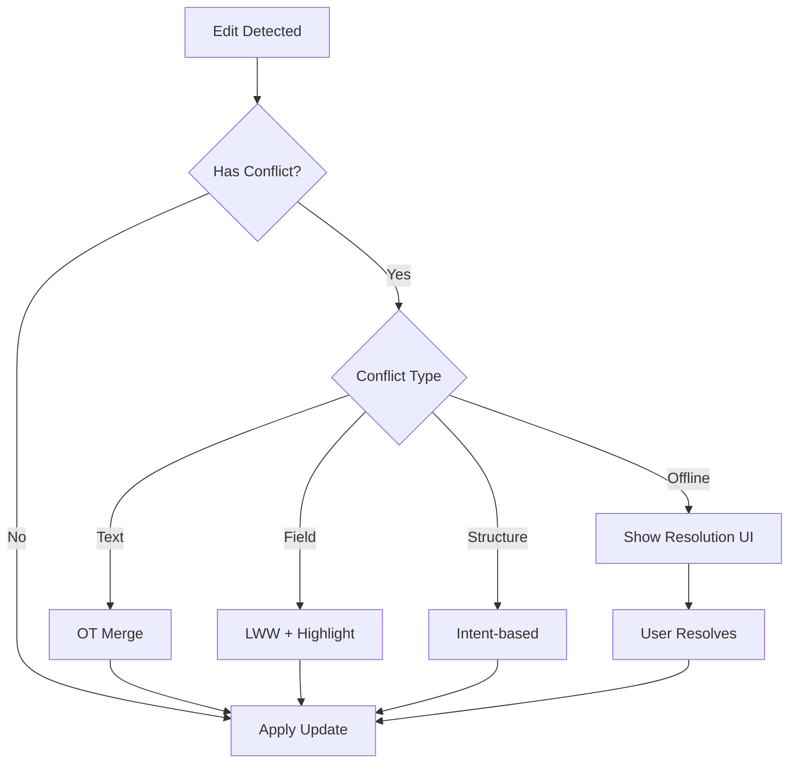

# ContentForge AI - Phase 4 Detailed Specifications

> Detailed technical specifications for Phase 4 features: Real-Time Collaboration, Advanced Analytics, Enterprise Features, AI Enhancements, and Marketplace.

---

## Table of Contents

1. [Real-Time Collaboration](#1-real-time-collaboration)
2. [Advanced Analytics](#2-advanced-analytics)
3. [Enterprise Features](#3-enterprise-features)
4. [AI Enhancements](#4-ai-enhancements)
5. [Marketplace](#5-marketplace)

---

## 1. Real-Time Collaboration

### 1.1 Multi-User Editing

#### Overview
Enable multiple users to edit content simultaneously with conflict-free merging using CRDTs (Conflict-free Replicated Data Types).

#### User Stories
- **US-COLL-001**: As a team member, I want to edit content simultaneously with my colleagues so we can collaborate efficiently
- **US-COLL-002**: As a content manager, I want to see who is editing which section so I can coordinate work
- **US-COLL-003**: As a user, I want my changes to sync in real-time so I see updates immediately

#### Functional Requirements

| ID | Requirement | Priority | Acceptance Criteria |
|----|-------------|----------|---------------------|
| COLL-001 | Support up to 50 concurrent editors per document | P0 | Load test confirms 50 users with <100ms sync |
| COLL-002 | Changes sync within 100ms across all clients | P0 | 95th percentile latency <100ms |
| COLL-003 | Offline editing with automatic sync on reconnect | P1 | Changes queued locally, sync on reconnect |
| COLL-004 | Lock-free editing using CRDTs | P0 | No edit locks, automatic conflict resolution |
| COLL-005 | Granular field-level sync | P1 | Individual form fields sync independently |

#### Technical Specifications

**CRDT Implementation:**
```yaml
Library: Yjs (https://github.com/yjs/yjs)
Data Structures:
  - Y.Text: Rich text content
  - Y.Array: List items, blocks
  - Y.Map: Metadata, settings
  - Y.XmlFragment: Structured content

Conflict Resolution:
  - Automatic: Last-write-wins for metadata
  - Operational Transformation for text
  - Positional updates for arrays
```

**Sync Protocol:**
```yaml
Transport: WebSocket
Protocol: Yjs binary protocol (y-protocols)
Fallback: HTTP long-polling for WebSocket failures
Reconnection: Exponential backoff, max 5 retries
Sync Strategy:
  - Initial: Full state sync
  - Ongoing: Delta updates
  - Reconnect: State vector comparison
```

**Data Model:**
```typescript
interface CollaborativeDocument {
  id: string;
  ydoc: Y.Doc;
  users: Map<string, UserPresence>;
  persistence: {
    provider: 'websocket' | 'indexeddb';
    lastSynced: Date;
    pendingUpdates: number;
  };
}

interface UserPresence {
  userId: string;
  userName: string;
  userColor: string;
  cursor: CursorPosition;
  selection: SelectionRange | null;
  lastSeen: Date;
}
```

#### API Endpoints

```yaml
WebSocket Endpoint:
  url: wss://api.contentforge.ai/v1/collab/{documentId}
  authentication: JWT token in query param
  protocols: ["yjs"]

REST Endpoints:
  GET /api/v1/documents/{id}/collaborators:
    response: UserPresence[]
    
  POST /api/v1/documents/{id}/join:
    body: { userId, cursorPosition }
    response: { success: true, syncState }
    
  POST /api/v1/documents/{id}/leave:
    body: { userId }
```

---

### 1.2 Presence Indicators

#### Overview
Show who is currently viewing or editing a document with real-time presence updates.

#### Functional Requirements

| ID | Requirement | Priority | Acceptance Criteria |
|----|-------------|----------|---------------------|
| PRES-001 | Display active users in document header | P0 | Avatars shown with tooltips |
| PRES-002 | Show user status (editing, viewing, idle) | P0 | Status updates within 5 seconds |
| PRES-003 | Assign unique colors to each user | P0 | Consistent colors per session |
| PRES-004 | Idle timeout after 5 minutes | P1 | User marked idle automatically |
| PRES-005 | "Following" mode to track user viewport | P2 | Scroll follows selected user |

#### UI Specifications

```yaml
Components:
  PresenceBar:
    - Location: Document header, right side
    - Max visible: 5 avatars + "+N" overflow
    - Tooltip: "{name} is {action} {section}"
    
  UserAvatar:
    - Size: 32x32px
    - Border: 2px solid userColor
    - Badge: Status indicator (green=active, yellow=idle, gray=offline)
    
Colors (auto-assigned):
  - #FF6B6B (Red)
  - #4ECDC4 (Teal)
  - #45B7D1 (Blue)
  - #96CEB4 (Green)
  - #FFEAA7 (Yellow)
  - #DDA0DD (Purple)
  - #98D8C8 (Mint)
  - #F7DC6F (Gold)
```

#### Technical Implementation

```typescript
// Presence state management
class PresenceManager {
  private presenceMap: Map<string, UserPresence>;
  private awareness: awarenessProtocol.Awareness;
  
  updatePresence(userId: string, update: Partial<UserPresence>) {
    const current = this.presenceMap.get(userId);
    this.awareness.setLocalState({
      ...current,
      ...update,
      lastSeen: new Date()
    });
  }
  
  getActiveUsers(): UserPresence[] {
    return Array.from(this.presenceMap.values())
      .filter(u => Date.now() - u.lastSeen.getTime() < 300000); // 5 min
  }
}
```

---

### 1.3 Conflict Resolution

#### Overview
Handle simultaneous edits gracefully using CRDTs with clear visual feedback when conflicts occur.

#### Conflict Types

| Type | Resolution Strategy | Visual Indicator |
|------|---------------------|------------------|
| Text concurrent edit | OT merge | None (automatic) |
| Field value conflict | Last-write-wins | Brief highlight of change |
| Structure change | Intent-based merge | Toast notification |
| Offline conflict | Branch + merge UI | Conflict resolution modal |

#### Resolution Flow



---

### 1.4 Live Cursors

#### Overview
Display other users' cursor positions and text selections in real-time.

#### Functional Requirements

| ID | Requirement | Priority | Acceptance Criteria |
|----|-------------|----------|---------------------|
| CURSOR-001 | Show cursor position with user name label | P0 | Smooth updates at 15fps |
| CURSOR-002 | Display text selections with user color | P0 | Selection range synced |
| CURSOR-003 | Cursor label shows user name on hover | P1 | Fade animation on hover |
| CURSOR-004 | Hide cursors outside viewport | P1 | Performance optimization |
| CURSOR-005 | Cursor smoothing/interpolation | P2 | 200ms interpolation buffer |

#### UI Implementation

```css
/* Cursor styles */
.collab-cursor {
  position: absolute;
  pointer-events: none;
  transition: transform 100ms ease-out;
}

.collab-cursor::before {
  content: '';
  position: absolute;
  width: 2px;
  height: 1.2em;
  background: var(--user-color);
}

.collab-cursor-label {
  position: absolute;
  top: -1.5em;
  left: -2px;
  background: var(--user-color);
  color: white;
  padding: 2px 6px;
  border-radius: 3px;
  font-size: 11px;
  white-space: nowrap;
}

.collab-selection {
  background: var(--user-color-alpha);
  mix-blend-mode: multiply;
}
```

---

### 1.5 Version History

#### Overview
Track all document changes with point-in-time recovery and diff visualization.

#### Functional Requirements

| ID | Requirement | Priority | Acceptance Criteria |
|----|-------------|----------|---------------------|
| VERS-001 | Save version every 5 minutes + on explicit save | P0 | Configurable interval |
| VERS-002 | Store minimum 100 versions per document | P0 | Automatic cleanup after 100 |
| VERS-003 | Visual diff between any two versions | P1 | Side-by-side or inline diff |
| VERS-004 | One-click restore to any version | P1 | Confirmation required |
| VERS-005 | Named versions/bookmarks | P2 | User can label important versions |
| VERS-006 | Version author tracking | P1 | Shows who made changes |

#### Data Model

```typescript
interface DocumentVersion {
  id: string;
  documentId: string;
  versionNumber: number;
  snapshot: Y.Snapshot; // Yjs state snapshot
  createdAt: Date;
  createdBy: string;
  changeSummary: string; // AI-generated or manual
  namedVersion: string | null; // User-defined name
  metadata: {
    wordCount: number;
    characterCount: number;
    editorCount: number;
  };
}

interface VersionDiff {
  added: number; // characters added
  removed: number; // characters removed
  changed: number; // characters changed
  blocks: DiffBlock[];
}
```

---

## 2. Advanced Analytics

### 2.1 Cohort Analysis

#### Overview
Track user cohorts over time to understand retention, engagement patterns, and content performance by acquisition source.

#### User Stories
- **US-ANA-001**: As a growth marketer, I want to see retention by sign-up cohort so I can measure growth health
- **US-ANA-002**: As a product manager, I want to compare engagement across user cohorts to identify feature adoption
- **US-ANA-003**: As an executive, I want to see content performance by user acquisition date to assess long-term value

#### Functional Requirements

| ID | Requirement | Priority | Acceptance Criteria |
|----|-------------|----------|---------------------|
| COH-001 | Daily/weekly/monthly cohort grouping | P0 | User-selectable granularity |
| COH-002 | Retention curves by cohort | P0 | Day 1, 7, 30, 90 retention |
| COH-003 | Cohort breakdown by acquisition source | P1 | UTM source tracking |
| COH-004 | Content performance by cohort | P1 | Avg content created per cohort |
| COH-005 | Revenue analysis by cohort | P1 | LTV curves by cohort |
| COH-006 | Export cohort data to CSV | P2 | All visible data exportable |

#### Cohort Definition

```yaml
Cohort Dimensions:
  - acquisition_date: Date user first signed up
  - acquisition_source: utm_source, referrer
  - plan_type: Free, Starter, Pro, Enterprise
  - content_type: Primary use case
  - team_size: Individual, Small Team, Enterprise

Metrics:
  - retention_rate: % users active on day N
  - engagement_score: Content created × quality factor
  - revenue_per_cohort: Total revenue / cohort size
  - content_velocity: Content pieces / days since signup
```

#### SQL Schema

```sql
-- Cohort analysis materialized view
CREATE MATERIALIZED VIEW cohort_analysis AS
WITH user_activity AS (
  SELECT 
    u.id as user_id,
    DATE_TRUNC('week', u.created_at) as cohort_week,
    u.utm_source,
    u.plan_type,
    DATE_TRUNC('day', c.created_at) as activity_day,
    COUNT(c.id) as content_count
  FROM users u
  LEFT JOIN content c ON c.user_id = u.id
  GROUP BY u.id, u.created_at, u.utm_source, c.created_at
)
SELECT 
  cohort_week,
  utm_source,
  plan_type,
  COUNT(DISTINCT user_id) as cohort_size,
  -- Day 0 retention (signed up)
  COUNT(DISTINCT user_id) as d0_users,
  -- Day 1 retention
  COUNT(DISTINCT CASE WHEN activity_day = cohort_week + INTERVAL '1 day' 
    THEN user_id END) as d1_users,
  -- Day 7 retention
  COUNT(DISTINCT CASE WHEN activity_day = cohort_week + INTERVAL '7 days' 
    THEN user_id END) as d7_users,
  -- Day 30 retention
  COUNT(DISTINCT CASE WHEN activity_day = cohort_week + INTERVAL '30 days' 
    THEN user_id END) as d30_users
FROM user_activity
GROUP BY cohort_week, utm_source, plan_type;

-- Refresh daily
CREATE INDEX idx_cohort_analysis_week ON cohort_analysis(cohort_week);
```

---

### 2.2 Funnel Tracking

#### Overview
Track user progression through key workflows to identify drop-off points and optimization opportunities.

#### Predefined Funnels

| Funnel | Steps | Purpose |
|--------|-------|---------|
| **Onboarding** | Signup → First Project → First Content → First Distribution | Activation optimization |
| **Upgrade** | Free → Trial Start → Payment → First Paid Action | Conversion optimization |
| **Content Creation** | Create → AI Generate → Edit → Distribute → Publish | Workflow optimization |
| **Team Adoption** | Invite → Accept → Create → Collaborate | Team expansion |

#### Functional Requirements

| ID | Requirement | Priority | Acceptance Criteria |
|----|-------------|----------|---------------------|
| FUN-001 | Visual funnel chart with conversion rates | P0 | Sankey or bar chart visualization |
| FUN-002 | Time-to-complete per step | P0 | Average and median duration |
| FUN-003 | Drop-off analysis by segment | P1 | Compare funnels by user type |
| FUN-004 | Funnel comparison (A/B) | P2 | Compare two time periods |
| FUN-005 | Custom funnel builder | P2 | User-defined event sequences |

#### Event Tracking Schema

```typescript
interface FunnelEvent {
  id: string;
  userId: string;
  sessionId: string;
  funnelId: string;
  stepName: string;
  stepNumber: number;
  timestamp: Date;
  metadata: Record<string, any>;
  deviceInfo: {
    userAgent: string;
    screenSize: string;
    referrer: string;
  };
}

// Example funnel steps
const ONBOARDING_FUNNEL = [
  { name: 'signup_complete', event: 'user.created' },
  { name: 'first_project', event: 'project.created' },
  { name: 'first_content', event: 'content.created' },
  { name: 'first_distribution', event: 'distribution.completed' }
];
```

---

### 2.3 Attribution Modeling

#### Overview
Attribute content performance and conversions to specific channels, campaigns, and touchpoints.

#### Attribution Models

| Model | Description | Use Case |
|-------|-------------|----------|
| **First Touch** | 100% credit to first interaction | Brand awareness |
| **Last Touch** | 100% credit to last interaction | Direct response |
| **Linear** | Equal credit to all touches | Full journey view |
| **Time Decay** | More credit to recent touches | Short sales cycles |
| **Position-Based** | 40% first, 40% last, 20% middle | Balanced view |
| **Data-Driven** | ML-based attribution | Enterprise accuracy |

#### Functional Requirements

| ID | Requirement | Priority | Acceptance Criteria |
|----|-------------|----------|---------------------|
| ATTR-001 | First touch attribution | P0 | UTM params captured on signup |
| ATTR-002 | Last touch attribution | P0 | Conversion event attribution |
| ATTR-003 | Linear attribution | P1 | Multi-touch credit distribution |
| ATTR-004 | Custom attribution model | P2 | User-defined weighting |
| ATTR-005 | Attribution by content piece | P1 | Per-content performance |
| ATTR-006 | Channel performance comparison | P1 | Side-by-side channel metrics |

#### Data Model

```typescript
interface Touchpoint {
  id: string;
  userId: string;
  timestamp: Date;
  channel: string; // organic, paid, social, email, direct
  source: string; // utm_source
  medium: string; // utm_medium
  campaign: string; // utm_campaign
  content: string; // utm_content
  landingPage: string;
  referrer: string;
}

interface AttributionResult {
  conversionId: string;
  conversionValue: number;
  model: AttributionModel;
  touchpoints: Touchpoint[];
  credits: Map<string, number>; // touchpointId -> credit %
}
```

---

### 2.4 Custom Dashboards

#### Overview
Allow users to create personalized analytics dashboards with configurable widgets and layouts.

#### Widget Types

| Widget | Description | Data Source |
|--------|-------------|-------------|
| **Metric Card** | Single KPI with trend | Aggregated metrics |
| **Line Chart** | Time series visualization | Time-series data |
| **Bar Chart** | Category comparison | Aggregated categories |
| **Pie Chart** | Distribution breakdown | Percentage data |
| **Funnel Chart** | Conversion visualization | Funnel events |
| **Table** | Detailed data view | Raw or aggregated data |
| **Cohort Grid** | Retention matrix | Cohort analysis |
| **Text/Note** | Free-form annotation | User input |

#### Functional Requirements

| ID | Requirement | Priority | Acceptance Criteria |
|----|-------------|----------|---------------------|
| DASH-001 | Drag-and-drop widget placement | P0 | 12-column grid system |
| DASH-002 | Widget resize (small/medium/large) | P0 | 3 size options per widget |
| DASH-003 | Date range selector (global) | P0 | Applies to all widgets |
| DASH-004 | Widget-specific filters | P1 | Override global filters |
| DASH-005 | Dashboard sharing | P2 | View-only and edit links |
| DASH-006 | Dashboard templates | P2 | 5+ pre-built templates |
| DASH-007 | Scheduled email reports | P2 | Daily/weekly/monthly |

#### Dashboard Schema

```typescript
interface Dashboard {
  id: string;
  name: string;
  description: string;
  ownerId: string;
  organizationId: string;
  isTemplate: boolean;
  isShared: boolean;
  layout: DashboardLayout;
  widgets: Widget[];
  globalFilters: {
    dateRange: { start: Date; end: Date };
    compareTo: 'previous_period' | 'previous_year' | null;
  };
  refreshInterval: number | null; // seconds, null = manual
  createdAt: Date;
  updatedAt: Date;
}

interface Widget {
  id: string;
  type: WidgetType;
  title: string;
  position: { x: number; y: number; w: number; h: number };
  config: WidgetConfig;
  dataQuery: DataQuery;
}

type WidgetType = 
  | 'metric_card' 
  | 'line_chart' 
  | 'bar_chart' 
  | 'pie_chart' 
  | 'funnel'
  | 'table'
  | 'cohort_grid'
  | 'text';
```

---

### 2.5 Report Scheduling

#### Overview
Automatically generate and email analytics reports on a scheduled basis.

#### Functional Requirements

| ID | Requirement | Priority | Acceptance Criteria |
|----|-------------|----------|---------------------|
| SCHED-001 | Daily report scheduling | P2 | Email sent at configured time |
| SCHED-002 | Weekly report scheduling | P2 | Day of week selectable |
| SCHED-003 | Monthly report scheduling | P2 | Day of month selectable |
| SCHED-004 | Multiple recipients | P2 | Comma-separated emails |
| SCHED-005 | Report format (PDF/CSV) | P2 | Attachment options |
| SCHED-006 | Report preview before scheduling | P2 | Preview modal |

---

## 3. Enterprise Features

### 3.1 SSO - SAML 2.0

#### Overview
Enable enterprise customers to authenticate via SAML 2.0 identity providers (IdP).

#### Supported IdPs
- Okta
- Azure AD / Entra ID
- Google Workspace
- OneLogin
- Ping Identity
- Custom SAML 2.0

#### Functional Requirements

| ID | Requirement | Priority | Acceptance Criteria |
|----|-------------|----------|---------------------|
| SAML-001 | SAML 2.0 SP-initiated SSO | P0 | Full SAML 2.0 compliance |
| SAML-002 | SAML 2.0 IdP-initiated SSO | P0 | Works with all major IdPs |
| SAML-003 | Automatic user provisioning (JIT) | P0 | New users created on first login |
| SAML-004 | SAML attribute mapping | P0 | Email, name, role mapping |
| SAML-005 | SAML certificate management | P1 | Self-service cert rotation |
| SAML-006 | Multiple IdPs per organization | P2 | Support hybrid environments |

#### Configuration Schema

```typescript
interface SAMLConfig {
  organizationId: string;
  enabled: boolean;
  
  // IdP Configuration
  idpMetadataUrl: string;
  idpEntityId: string;
  idpSsoUrl: string;
  idpCertificate: string;
  
  // SP Configuration
  spEntityId: string; // https://api.contentforge.ai/saml/{orgId}
  spAcsUrl: string; // Assertion Consumer Service
  spCertificate: string;
  spPrivateKey: string;
  
  // Attribute Mapping
  attributeMapping: {
    email: string; // default: email
    firstName: string; // default: firstName
    lastName: string; // default: lastName
    role: string; // default: role
    groups: string; // default: groups
  };
  
  // Security Settings
  signatureAlgorithm: 'rsa-sha256' | 'rsa-sha512';
  nameIdFormat: 'emailAddress' | 'persistent' | 'transient';
  authnContext: string;
  
  // Just-in-Time Provisioning
  jitProvisioning: boolean;
  defaultRole: 'member' | 'admin';
  allowedDomains: string[];
}
```

#### API Endpoints

```yaml
GET /api/v1/auth/saml/{organizationId}/metadata:
  description: SP metadata for IdP configuration
  response: XML SAML metadata

POST /api/v1/auth/saml/{organizationId}/acs:
  description: Assertion Consumer Service endpoint
  body: SAMLResponse (form-encoded)
  
POST /api/v1/organizations/{id}/saml/configure:
  description: Configure SAML for organization
  body: SAMLConfig
  auth: Organization admin
  
POST /api/v1/organizations/{id}/saml/test:
  description: Test SAML configuration
  response: { success: boolean, errors: string[] }
```

---

### 3.2 SSO - OIDC

#### Overview
Support OpenID Connect authentication for modern identity providers.

#### Supported Providers
- Google OAuth 2.0
- Microsoft Identity Platform
- Auth0
- Okta (OIDC)
- Keycloak
- Custom OIDC

#### Functional Requirements

| ID | Requirement | Priority | Acceptance Criteria |
|----|-------------|----------|---------------------|
| OIDC-001 | OIDC Authorization Code flow | P0 | PKCE support included |
| OIDC-002 | ID token validation | P0 | Signature and claims verification |
| OIDC-003 | Refresh token handling | P1 | Automatic token refresh |
| OIDC-004 | OIDC logout (RP-initiated) | P1 | Proper session termination |
| OIDC-005 | Claims mapping | P1 | Custom claim to user attribute |

---

### 3.3 Audit Logs

#### Overview
Comprehensive audit logging for compliance, security, and operational transparency.

#### Event Categories

| Category | Events | Retention |
|----------|--------|-----------|
| **Authentication** | Login, logout, MFA, password change | 7 years |
| **Authorization** | Permission changes, role assignments | 7 years |
| **Content** | Create, update, delete, publish | 3 years |
| **Organization** | Member add/remove, settings change | 7 years |
| **Billing** | Subscription changes, payments | 7 years |
| **Admin** | Admin actions, impersonation | 7 years |
| **API** | API key creation, rate limit events | 1 year |
| **Security** | Failed login, suspicious activity | 1 year |

#### Functional Requirements

| ID | Requirement | Priority | Acceptance Criteria |
|----|-------------|----------|---------------------|
| AUDIT-001 | Log all authentication events | P0 | Every login/logout captured |
| AUDIT-002 | Log all data modifications | P0 | CRUD operations tracked |
| AUDIT-003 | Immutable log storage | P0 | WORM storage or cryptographic verification |
| AUDIT-004 | Audit log search and filter | P0 | By user, action, date, resource |
| AUDIT-005 | Audit log export (CSV/JSON) | P1 | Full export capability |
| AUDIT-006 | Real-time audit streaming | P2 | Webhook or SIEM integration |
| AUDIT-007 | Tamper detection | P2 | Hash chain or blockchain verification |

#### Audit Event Schema

```typescript
interface AuditEvent {
  id: string; // ULID for sortability
  timestamp: Date; // ISO 8601 UTC
  organizationId: string;
  
  // Actor
  actor: {
    type: 'user' | 'api_key' | 'system' | 'webhook';
    id: string;
    email?: string;
    ipAddress: string;
    userAgent: string;
    sessionId?: string;
  };
  
  // Action
  action: {
    type: string; // user.login, content.create, etc.
    category: AuditCategory;
    description: string;
  };
  
  // Target Resource
  resource: {
    type: string; // user, content, project, etc.
    id: string;
    name?: string;
  };
  
  // Context
  context: {
    requestId: string;
    changes?: ChangeRecord[];
    metadata?: Record<string, any>;
  };
  
  // Result
  result: 'success' | 'failure' | 'denied';
  errorMessage?: string;
}

interface ChangeRecord {
  field: string;
  oldValue: any;
  newValue: any;
}

type AuditCategory = 
  | 'authentication' 
  | 'authorization' 
  | 'content' 
  | 'organization'
  | 'billing'
  | 'admin'
  | 'api'
  | 'security';
```

#### Storage Strategy

```yaml
Hot Storage (0-90 days):
  - PostgreSQL with time-series partitioning
  - Queryable via API
  - Retention: 90 days
  - Cost: ~$50/month per 10M events

Warm Storage (90 days - 1 year):
  - Parquet files in object storage (R2)
  - Queryable via analytics pipeline
  - Retention: 1 year
  - Cost: ~$5/month per 10M events

Cold Storage (1+ years):
  - Compressed archives (GZIP)
  - Glacier-style storage
  - Retrieval: 24-48 hours
  - Retention: 7 years
  - Cost: ~$1/month per 10M events
```

---

### 3.4 Data Retention Policies

#### Overview
Configurable data retention policies for compliance with GDPR, CCPA, and other regulations.

#### Policy Types

| Policy | Description | Default |
|--------|-------------|---------|
| **Content Retention** | How long content is kept | Forever (configurable) |
| **Audit Retention** | Audit log retention | 7 years |
| **Analytics Retention** | Raw analytics data | 2 years |
| **Session Retention** | User session data | 90 days |
| **Backup Retention** | Backup snapshots | 30 days |
| **Trash Retention** | Soft-deleted items | 30 days |

#### Functional Requirements

| ID | Requirement | Priority | Acceptance Criteria |
|----|-------------|----------|---------------------|
| RET-001 | Organization-level retention policies | P1 | Admin configurable per org |
| RET-002 | Automatic data purging | P1 | Cron job with audit logging |
| RET-003 | Legal hold capability | P2 | Suspend deletion for legal matters |
| RET-004 | Data export before deletion | P2 | User notification + export |
| RET-005 | Retention policy audit | P2 | Report of what was deleted when |

---

### 3.5 Custom Integrations

#### Overview
Framework for enterprise customers to build custom integrations with internal systems.

#### Functional Requirements

| ID | Requirement | Priority | Acceptance Criteria |
|----|-------------|----------|---------------------|
| CINT-001 | Custom webhook destinations | P1 | User-configurable endpoints |
| CINT-002 | Custom API authentication | P1 | API key and OAuth support |
| CINT-003 | Event filtering for webhooks | P2 | Select which events trigger |
| CINT-004 | Webhook retry logic | P1 | Exponential backoff, max 5 retries |
| CINT-005 | Integration health monitoring | P2 | Success rate and latency metrics |

---

### 3.6 SLA Monitoring

#### Overview
Service Level Agreement monitoring and reporting for enterprise customers.

#### SLA Metrics

| Metric | Target | Measurement |
|--------|--------|-------------|
| **Uptime** | 99.95% | Excluding scheduled maintenance |
| **API Response Time** | <200ms p95 | All authenticated endpoints |
| **Webhook Delivery** | 99.9% | Within 60 seconds |
| **Support Response** | <4 hours | Enterprise tickets |
| **Recovery Time** | <4 hours | RTO for critical failures |

#### Functional Requirements

| ID | Requirement | Priority | Acceptance Criteria |
|----|-------------|----------|---------------------|
| SLA-001 | Real-time uptime dashboard | P2 | Public status page |
| SLA-002 | Monthly SLA report | P2 | Automated email to admins |
| SLA-003 | Incident notification | P2 | Email + webhook on degradation |
| SLA-004 | SLA credit calculation | P2 | Automatic for missed targets |

---

## 4. AI Enhancements

### 4.1 Custom AI Model Training

#### Overview
Allow enterprise customers to train custom AI models on their brand voice, style guides, and proprietary content.

#### Training Data Sources

| Source | Description | Minimum Data |
|--------|-------------|--------------|
| **Existing Content** | Historical content library | 50+ pieces |
| **Style Guide** | Brand guidelines document | 1 comprehensive guide |
| **Sample Outputs** | Desired tone examples | 20+ examples |
| **Negative Examples** | What NOT to write | 10+ examples |

#### Functional Requirements

| ID | Requirement | Priority | Acceptance Criteria |
|----|-------------|----------|---------------------|
| CMT-001 | Fine-tuning UI for model training | P1 | Upload + configure workflow |
| CMT-002 | Training progress tracking | P1 | Real-time status updates |
| CMT-003 | Model evaluation metrics | P1 | Perplexity, BLEU, human eval |
| CMT-004 | A/B testing between models | P2 | Compare outputs side-by-side |
| CMT-005 | Model versioning | P1 | Rollback to previous versions |
| CMT-006 | Private model hosting | P1 | Model isolated per organization |

#### Technical Approach

```yaml
Base Model: Llama 3.3 70B or GPT-4 (via API)
Fine-tuning Method: LoRA (Low-Rank Adaptation)
Training Infrastructure: Modal.com or RunPod
Cost Estimate: $50-200 per fine-tuning run
Inference: Dedicated endpoints per organization
Security: Models encrypted at rest, VPC isolation
```

---

### 4.2 Sentiment Analysis

#### Overview
Analyze content sentiment to ensure tone alignment with brand and audience expectations.

#### Analysis Dimensions

| Dimension | Description | Output |
|-----------|-------------|--------|
| **Overall Sentiment** | Positive/negative/neutral | Score -1 to +1 |
| **Emotion Detection** | Joy, anger, sadness, fear, etc. | Confidence scores |
| **Tone Analysis** | Formal, casual, enthusiastic, etc. | Top 3 tones |
| **Audience Fit** | Appropriateness for target audience | Rating 1-5 |

#### Functional Requirements

| ID | Requirement | Priority | Acceptance Criteria |
|----|-------------|----------|---------------------|
| SENT-001 | Real-time sentiment analysis | P0 | <500ms per analysis |
| SENT-002 | Sentiment trend over time | P1 | Dashboard of sentiment history |
| SENT-003 | Sentiment by platform | P1 | Compare across distribution channels |
| SENT-004 | Sentiment alerts | P2 | Notify on negative sentiment spike |
| SENT-005 | Competitive sentiment comparison | P2 | Compare to competitor content |

#### Implementation

```python
# Using AIService with sentiment prompt
SENTIMENT_PROMPT = """
Analyze the following content for sentiment and tone:

Content: {content}
Target Audience: {audience}
Platform: {platform}

Provide analysis in this JSON format:
{
  "overall_sentiment": "positive|neutral|negative",
  "sentiment_score": -1.0 to 1.0,
  "emotions": {
    "joy": 0.0 to 1.0,
    "sadness": 0.0 to 1.0,
    "anger": 0.0 to 1.0,
    "fear": 0.0 to 1.0,
    "surprise": 0.0 to 1.0
  },
  "tone": ["formal", "casual", "enthusiastic", ...],
  "audience_fit": 1 to 5,
  "suggestions": ["string"]
}
"""
```

---

### 4.3 Content Quality Scoring

#### Overview
AI-powered content quality assessment across multiple dimensions.

#### Quality Dimensions

| Dimension | Weight | Criteria |
|-----------|--------|----------|
| **Readability** | 20% | Flesch-Kincaid, sentence length |
| **SEO Optimization** | 20% | Keyword density, meta completeness |
| **Engagement Potential** | 20% | Predicted CTR, shareability |
| **Grammar/Spelling** | 15% | Error count, severity |
| **Brand Consistency** | 15% | Tone match, terminology |
| **Originality** | 10% | Plagiarism check, uniqueness |

#### Functional Requirements

| ID | Requirement | Priority | Acceptance Criteria |
|----|-------------|----------|---------------------|
| QUAL-001 | Overall quality score (0-100) | P0 | Real-time calculation |
| QUAL-002 | Per-dimension scoring | P0 | Breakdown with explanations |
| QUAL-003 | Quality improvement suggestions | P0 | Actionable recommendations |
| QUAL-004 | Quality benchmark comparison | P1 | vs. industry averages |
| QUAL-005 | Quality trends over time | P2 | Team content quality dashboard |
| QUAL-006 | Minimum quality gates | P2 | Block publish below threshold |

#### Scoring Algorithm

```typescript
interface QualityScore {
  overall: number; // 0-100
  dimensions: {
    readability: { score: number; details: ReadabilityDetails };
    seo: { score: number; details: SEODetails };
    engagement: { score: number; details: EngagementDetails };
    grammar: { score: number; details: GrammarDetails };
    brand: { score: number; details: BrandDetails };
    originality: { score: number; details: OriginalityDetails };
  };
  suggestions: QualitySuggestion[];
  benchmark: {
    industry: number;
    percentile: number;
  };
}

function calculateOverallScore(dimensions: QualityDimensions): number {
  const weights = {
    readability: 0.20,
    seo: 0.20,
    engagement: 0.20,
    grammar: 0.15,
    brand: 0.15,
    originality: 0.10
  };
  
  return Object.entries(weights).reduce((sum, [key, weight]) => {
    return sum + dimensions[key].score * weight;
  }, 0);
}
```

---

### 4.4 Auto-Suggestions

#### Overview
Context-aware AI suggestions as users write content.

#### Suggestion Types

| Type | Trigger | Action |
|------|---------|--------|
| **Completion** | Pause typing | Complete sentence/paragraph |
| **Improvement** | Select text | Rewrite, expand, condense |
| **SEO** | Content analysis | Keyword suggestions |
| **Fact Check** | Claim detection | Verify against sources |
| **Citation** | Reference needed | Suggest sources |

#### Functional Requirements

| ID | Requirement | Priority | Acceptance Criteria |
|----|-------------|----------|---------------------|
| SUGG-001 | Inline completion suggestions | P0 | Tab to accept |
| SUGG-002 | Improvement suggestions panel | P0 | Floating side panel |
| SUGG-003 | Configurable suggestion frequency | P1 | High/medium/low/off |
| SUGG-004 | User feedback on suggestions | P1 | Thumbs up/down |
| SUGG-005 | Personalization based on acceptance rate | P2 | Learn user preferences |

---

### 4.5 Smart Categorization

#### Overview
Automatically categorize and tag content using AI for better organization and discovery.

#### Categorization Dimensions

| Dimension | Examples | Auto-Apply |
|-----------|----------|------------|
| **Topic** | AI, Marketing, Technology | Yes |
| **Content Type** | Blog, Social, Newsletter | Yes |
| **Tone** | Professional, Casual, Humorous | Yes |
| **Reading Level** | Beginner, Intermediate, Expert | Yes |
| **Custom Tags** | User-defined | Suggested |

#### Functional Requirements

| ID | Requirement | Priority | Acceptance Criteria |
|----|-------------|----------|---------------------|
| CAT-001 | Automatic topic detection | P2 | >80% accuracy |
| CAT-002 | Content type classification | P2 | >90% accuracy |
| CAT-003 | Custom tag suggestions | P2 | Based on content analysis |
| CAT-004 | Batch categorization | P2 | Apply to multiple items |
| CAT-005 | Category confidence scores | P2 | Show certainty level |

---

## 5. Marketplace

### 5.1 Template Marketplace

#### Overview
Platform for users to buy, sell, and share content templates.

#### Template Types

| Type | Description | Example |
|------|-------------|---------|
| **Content Templates** | Pre-built content structures | "Product Launch Announcement" |
| **Workflow Templates** | Automation workflows | "Weekly Newsletter Pipeline" |
| **Style Templates** | Brand voice configurations | "Casual Tech Startup Voice" |
| **Prompt Templates** | AI prompt collections | "SEO-Optimized Blog Prompts" |

#### Functional Requirements

| ID | Requirement | Priority | Acceptance Criteria |
|----|-------------|----------|---------------------|
| TEMP-001 | Template browsing and search | P0 | Category, rating, popularity filters |
| TEMP-002 | Template preview | P0 | See structure before purchase |
| TEMP-003 | Template purchase flow | P0 | Stripe integration, instant delivery |
| TEMP-004 | Template submission for creators | P0 | Upload, pricing, approval workflow |
| TEMP-005 | Creator revenue dashboard | P0 | Sales, revenue, payouts |
| TEMP-006 | Template ratings and reviews | P1 | 5-star + text reviews |
| TEMP-007 | Template versioning | P1 | Update with change logs |
| TEMP-008 | Free template tier | P1 | Lead generation templates |

#### Revenue Model

```yaml
Pricing Tiers:
  Free: $0 (lead gen, basic templates)
  Standard: $5-25 (single-use personal)
  Premium: $25-99 (commercial license)
  Enterprise: $100-500 (unlimited team use)

Revenue Split:
  Creator: 70%
  Platform: 25%
  Payment processing: 5%

Payout Schedule:
  - Minimum payout: $50
  - Frequency: Monthly
  - Method: Bank transfer or PayPal
```

#### Data Model

```typescript
interface Template {
  id: string;
  name: string;
  description: string;
  category: TemplateCategory;
  type: 'content' | 'workflow' | 'style' | 'prompt';
  
  // Creator
  creatorId: string;
  creatorName: string;
  
  // Content
  content: any; // Template-specific data
  preview: TemplatePreview;
  
  // Pricing
  pricing: {
    free: boolean;
    price: number;
    currency: string;
    tiers: PricingTier[];
  };
  
  // Stats
  stats: {
    downloads: number;
    rating: number;
    reviewCount: number;
    revenue: number;
  };
  
  // Status
  status: 'pending' | 'approved' | 'rejected' | 'suspended';
  createdAt: Date;
  updatedAt: Date;
  version: number;
}

interface TemplatePurchase {
  id: string;
  templateId: string;
  buyerId: string;
  sellerId: string;
  price: number;
  platformFee: number;
  sellerRevenue: number;
  license: LicenseType;
  purchasedAt: Date;
}
```

---

### 5.2 Plugin System

#### Overview
Extensible plugin architecture for third-party developers to extend ContentForge functionality.

#### Plugin Types

| Type | Capabilities | Example |
|------|------------|---------|
| **Source Plugins** | Import from external sources | WordPress importer |
| **Distribution Plugins** | Export to new platforms | Discord webhook |
| **AI Plugins** | Custom AI providers | Anthropic Claude integration |
| **UI Plugins** | Custom editor components | Grammar checker overlay |
| **Workflow Plugins** | Custom automation steps | Slack notification step |

#### Plugin Architecture

```typescript
// Plugin manifest
interface PluginManifest {
  id: string;
  name: string;
  version: string;
  author: string;
  description: string;
  type: PluginType;
  
  // Permissions
  permissions: PluginPermission[];
  
  // Entry points
  entryPoints: {
    editor?: string; // URL to editor script
    settings?: string; // URL to settings page
    webhook?: string; // Webhook handler URL
  };
  
  // Configuration schema
  configSchema: JSONSchema;
  
  // Hooks
  hooks: {
    onContentSave?: boolean;
    onDistribution?: boolean;
    onUserAction?: string[];
  };
}

// Plugin sandbox
interface PluginSandbox {
  // Limited APIs available to plugins
  content: {
    getCurrent(): Promise<Content>;
    update(partial: Partial<Content>): Promise<void>;
  };
  ui: {
    showNotification(message: string): void;
    openModal(component: React.Component): void;
  };
  api: {
    fetch(url: string, options: RequestInit): Promise<Response>;
  };
}
```

#### Security Model

```yaml
Sandboxing:
  - IFrame isolation for UI plugins
  - Serverless functions for API plugins
  - CSP restrictions on loaded scripts

Permissions:
  - content:read - Read content data
  - content:write - Modify content
  - user:read - Read user profile
  - distribution:trigger - Trigger distributions
  - webhook:receive - Receive webhooks

Review Process:
  - Automated security scan
  - Code review for approved publishers
  - Manual review for new publishers
```

---

### 5.3 Developer SDK

#### Overview
Official SDK for building ContentForge integrations and plugins.

#### SDK Components

| Component | Language | Features |
|-----------|----------|----------|
| **REST SDK** | Python, JS, Go | Type-safe API clients |
| **Webhook SDK** | Any | Webhook verification, parsing |
| **Plugin SDK** | TypeScript | React components, hooks |
| **CLI** | Node.js | Plugin scaffolding, deployment |

#### Functional Requirements

| ID | Requirement | Priority | Acceptance Criteria |
|----|-------------|----------|---------------------|
| SDK-001 | REST API client libraries | P1 | Python, TypeScript, Go |
| SDK-002 | TypeScript definitions | P1 | Full API type coverage |
| SDK-003 | Authentication helpers | P1 | API key, OAuth helpers |
| SDK-004 | Retry and error handling | P1 | Built-in resilience |
| SDK-005 | Plugin development CLI | P2 | create-plugin, dev server, publish |
| SDK-006 | Webhook payload validation | P2 | Signature verification |
| SDK-007 | React hooks for plugins | P2 | useContent, useUser, etc. |

---

### 5.4 Expert Marketplace

#### Overview
Connect businesses with content experts for services like editing, strategy, and training.

#### Service Types

| Service | Description | Pricing Model |
|---------|-------------|---------------|
| **Content Editing** | Professional editing and proofreading | Per-word or hourly |
| **Content Strategy** | Strategic planning and audits | Project-based |
| **Brand Voice Development** | Custom voice and style creation | Fixed fee |
| **Template Creation** | Custom template development | Fixed fee |
| **Training** | Team onboarding and workshops | Hourly |

#### Functional Requirements

| ID | Requirement | Priority | Acceptance Criteria |
|----|-------------|----------|---------------------|
| EXPERT-001 | Expert profile and portfolio | P1 | Ratings, reviews, samples |
| EXPERT-002 | Service booking system | P1 | Calendar integration, deposits |
| EXPERT-003 | Project workspace | P1 | Shared content, messaging |
| EXPERT-004 | Escrow payment system | P1 | Milestone-based releases |
| EXPERT-005 | Dispute resolution | P2 | Mediation workflow |
| EXPERT-006 | Expert verification | P1 | Background checks, skill tests |

---

### 5.5 Affiliate System

#### Overview
Referral and affiliate program to drive growth through partner channels.

#### Program Tiers

| Tier | Requirements | Commission |
|------|--------------|------------|
| **Referrer** | Any user | 20% first month |
| **Affiliate** | Approved partner | 30% recurring, 12 months |
| **Partner** | High volume | 30% recurring + bonuses |

#### Functional Requirements

| ID | Requirement | Priority | Acceptance Criteria |
|----|-------------|----------|---------------------|
| AFF-001 | Unique referral links | P2 | Per-user tracking |
| AFF-002 | Affiliate dashboard | P2 | Clicks, conversions, earnings |
| AFF-003 | Payout management | P2 | Stripe Connect or PayPal |
| AFF-004 | Marketing materials | P2 | Banners, email templates |
| AFF-005 | Attribution tracking | P2 | 90-day cookie window |

---

## Summary

### Effort Summary by Pillar

| Pillar | P0 Effort | P1 Effort | P2 Effort | Total Sprints |
|--------|-----------|-----------|-----------|---------------|
| Real-Time Collaboration | 8 | 4 | 2 | 14 |
| Advanced Analytics | 4 | 8 | 4 | 16 |
| Enterprise Features | 8 | 6 | 4 | 18 |
| AI Enhancements | 4 | 6 | 6 | 16 |
| Marketplace | 4 | 8 | 8 | 20 |
| **Total** | **28** | **32** | **24** | **84** |

### Critical Path

The critical path for Phase 4 success:

1. **Q1**: Real-time collaboration foundation (WebSocket, CRDT)
2. **Q2**: Enterprise features (SSO, audit logs)
3. **Q3**: AI enhancements (quality scoring, sentiment)
4. **Q4**: Marketplace launch (templates, plugins)

### Dependencies

```
Real-Time Collaboration
  └── Requires: WebSocket infrastructure
  └── Requires: Yjs CRDT library

Advanced Analytics
  └── Requires: Event tracking pipeline
  └── Requires: Data warehouse (BigQuery/Snowflake)

Enterprise Features
  └── Requires: Organization model updates
  └── Requires: Audit log infrastructure

AI Enhancements
  └── Requires: AIService scaling
  └── Requires: Fine-tuning infrastructure

Marketplace
  └── Requires: Payment processing (Stripe Connect)
  └── Requires: Plugin sandbox environment
```

---

*Document Version: 1.0*  
*Last Updated: 2026-04-13*
